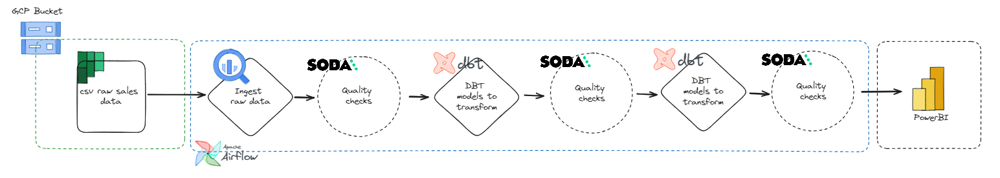
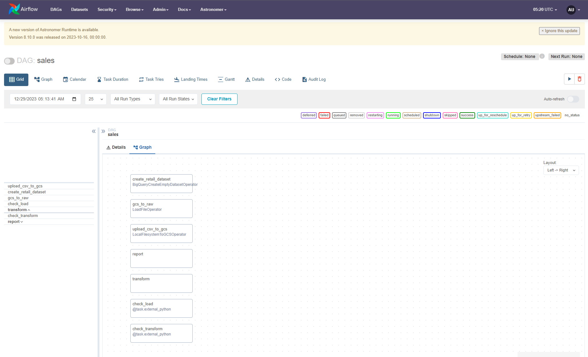

# Yalo Take-Home Challege 

Table of Contents
=================
 * [Project Tree](#project_tree)
 * [Task #1](#task_1)
 * [Task #2](#task_2)

## Project_Tree
```python
       📦.dbt
        ┣ 📂models
        ┃ ┣ 📂reports
        ┃ ┃ ┣ 📜report_category_more_revenue copy.sql
        ┃ ┃ ┗ 📜report_stores_more_revenue.sql
        ┃ ┣ 📂sources
        ┃ ┃ ┗ 📜sources.yml
        ┃ ┗ 📂transform
        ┃ ┃ ┣ 📜dim_category.sql
        ┃ ┃ ┣ 📜dim_date.sql
        ┃ ┃ ┣ 📜dim_item.sql
        ┃ ┃ ┣ 📜dim_store.sql
        ┃ ┃ ┣ 📜dim_vendor.sql
        ┃ ┃ ┗ 📜fact_sales.sql
        ┣ 📜dbt_project.yml
        ┣ 📜packages.yml
        ┗ 📜profiles.yml
        📦dags
        ┣ 📜.airflowignore
        ┗ 📜sales.py
        📦include
        ┣ 📂dataset
        ┃ ┗ 📜sales.csv
        ┣ 📂gcp
        ┃ ┗ 📜service_account.json
        ┗ 📂soda
        ┃ ┣ 📂checks
        ┃ ┃ ┣ 📂sources
        ┃ ┃ ┃ ┗ 📜raw_sales.yml
        ┃ ┃ ┗ 📂transform
        ┃ ┃ ┃ ┣ 📜dim_category.yml
        ┃ ┃ ┃ ┣ 📜dim_date.yml
        ┃ ┃ ┃ ┣ 📜dim_item.yml
        ┃ ┃ ┃ ┣ 📜dim_store.yml
        ┃ ┃ ┃ ┣ 📜dim_vendor.yml
        ┃ ┃ ┃ ┗ 📜fact_sales.yml
        ┃ ┣ 📜check_function.py
        ┃ ┗ 📜configuration.yml
        ┃📜Dockerfile
        ┃📜requirements.txt
```

## Task_1
* Calculate the total products and revenue sold over time by quarter and
identify the month where the revenue sold was 10% above the average.
```sql
  WITH monthly_revenue AS (
  SELECT 
    EXTRACT(MONTH FROM date) AS month,
    EXTRACT(QUARTER FROM date) AS quarter,
    EXTRACT(YEAR FROM date) AS year,
    COUNT(DISTINCT item_number) AS total_products,
    SUM(sale_dollars) AS total_revenue
  FROM `bigquery-public-data.iowa_liquor_sales.sales`
  GROUP BY year, quarter, month
),
average_revenue AS (
  SELECT AVG(total_revenue) AS avg_revenue
  FROM monthly_revenue
)
SELECT 
  month, 
  year, 
  quarter, 
  total_products, 
  total_revenue,
  CASE 
    WHEN total_revenue > 1.1 * avg_revenue THEN 'Above Average'
    ELSE 'Below Average'
  END AS Revenue_Comparison
FROM monthly_revenue, average_revenue
ORDER BY year, quarter, month
```

* List the counties where the amount (in dollars) of purchases transactions went over $100K.
```sql
SELECT county
FROM `bigquery-public-data.iowa_liquor_sales.sales`
GROUP BY county
HAVING SUM(sale_dollars) > 100000;
```

* Identify the top 10 stores with more revenue in sold products and the bottom
stores with least revenue in sold products (apply a deduplication logic in case
it’s needed).
```sql
-- Top 10 stores with the most revenue
SELECT store_name, SUM(sale_dollars) as total_revenue
FROM `bigquery-public-data.iowa_liquor_sales.sales`
GROUP BY store_name
ORDER BY total_revenue DESC
LIMIT 10;

-- Bottom 10 stores with the least revenue
SELECT store_name, SUM(sale_dollars) as total_revenue
FROM `bigquery-public-data.iowa_liquor_sales.sales`
GROUP BY store_name
ORDER BY total_revenue ASC
LIMIT 10;
```

## Task_2

* Please provide a data lineage of the data pipeline and design appropriate data layers
for this case. Briefly describe what is the underlying logic of every layer and why you
chose it.

        ➥ It's important to mention that, when data modeling, it's crucial to be closely aligned with the business team to truly understand their needs. In the context of this test, I took a broader perspective. However, in a real-world scenario, we should always focus on modeling with the aim of identifying the business processes, granularity, dimensions, and measures.
    * To solve this task I first analysed the table an modeled the data using the start schema pattern as image below.

    * Afterward, I created a project using Dbt, employed SODA for data validation, utilized Airflow, and integrated Google BigQuery as the data warehouse for working on the data pipeline.
     
        ➜ sdsdsda
    
    * Below you can find the grid of the DAG
    
    * As a result, you can find the analytics tables under the following path.
        ```python
        📦.dbt
        ┣ 📂models
        ┃ ┣ 📂reports
        ┃ ┃ ┣ 📜report_category_more_revenue copy.sql
        ┃ ┃ ┗ 📜report_stores_more_revenue.sql
        ```

  