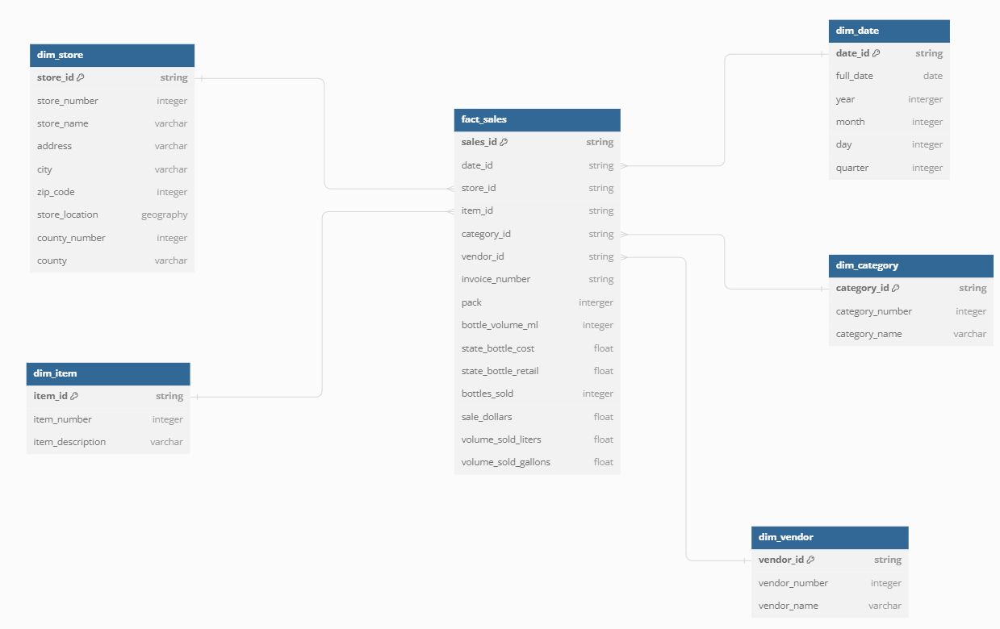
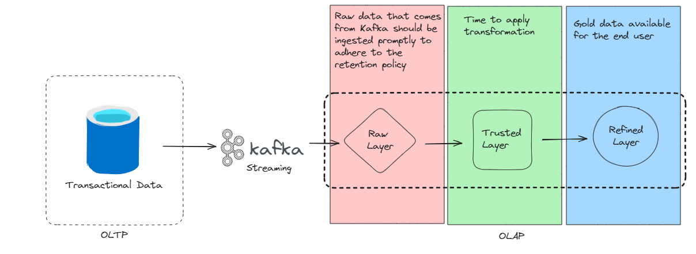

# Yalo Take-Home Challege 

Table of Contents
=================
 * [Project Tree](#project_tree)
 * [Task #1](#task_1)
 * [Task #2](#task_2)
 * [Task #3](#task_3)

## Project_Tree
```python
       📦.dbt
        ┣ 📂models
        ┃ ┣ 📂reports
        ┃ ┃ ┣ 📜report_category_more_revenue copy.sql
        ┃ ┃ ┗ 📜report_stores_more_revenue.sql
        ┃ ┣ 📂sources
        ┃ ┃ ┗ 📜sources.yml
        ┃ ┗ 📂transform
        ┃ ┃ ┣ 📜dim_category.sql
        ┃ ┃ ┣ 📜dim_date.sql
        ┃ ┃ ┣ 📜dim_item.sql
        ┃ ┃ ┣ 📜dim_store.sql
        ┃ ┃ ┣ 📜dim_vendor.sql
        ┃ ┃ ┗ 📜fact_sales.sql
        ┣ 📜dbt_project.yml
        ┣ 📜packages.yml
        ┗ 📜profiles.yml
        📦dags
        ┣ 📜.airflowignore
        ┗ 📜sales.py
        📦include
        ┣ 📂dataset
        ┃ ┗ 📜sales.csv
        ┣ 📂gcp
        ┃ ┗ 📜service_account.json
        ┗ 📂soda
        ┃ ┣ 📂checks
        ┃ ┃ ┣ 📂sources
        ┃ ┃ ┃ ┗ 📜raw_sales.yml
        ┃ ┃ ┗ 📂transform
        ┃ ┃ ┃ ┣ 📜dim_category.yml
        ┃ ┃ ┃ ┣ 📜dim_date.yml
        ┃ ┃ ┃ ┣ 📜dim_item.yml
        ┃ ┃ ┃ ┣ 📜dim_store.yml
        ┃ ┃ ┃ ┣ 📜dim_vendor.yml
        ┃ ┃ ┃ ┗ 📜fact_sales.yml
        ┃ ┣ 📜check_function.py
        ┃ ┗ 📜configuration.yml
        ┃📜Dockerfile
        ┃📜requirements.txt
```

## Task_1
### Calculate the total products and revenue sold over time by quarter and identify the month where the revenue sold was 10% above the average.
```sql
  WITH monthly_revenue AS (
  SELECT 
    EXTRACT(MONTH FROM date) AS month,
    EXTRACT(QUARTER FROM date) AS quarter,
    EXTRACT(YEAR FROM date) AS year,
    COUNT(DISTINCT item_number) AS total_products,
    SUM(sale_dollars) AS total_revenue
  FROM `bigquery-public-data.iowa_liquor_sales.sales`
  GROUP BY year, quarter, month
),
average_revenue AS (
  SELECT AVG(total_revenue) AS avg_revenue
  FROM monthly_revenue
)
SELECT 
  month, 
  year, 
  quarter, 
  total_products, 
  total_revenue,
  CASE 
    WHEN total_revenue > 1.1 * avg_revenue THEN 'Above Average'
    ELSE 'Below Average'
  END AS Revenue_Comparison
FROM monthly_revenue, average_revenue
ORDER BY year, quarter, month
```

### List the counties where the amount (in dollars) of purchases transactions went over $100K.
```sql
SELECT county
FROM `bigquery-public-data.iowa_liquor_sales.sales`
GROUP BY county
HAVING SUM(sale_dollars) > 100000;
```

### Identify the top 10 stores with more revenue in sold products and the bottom stores with least revenue in sold products (apply a deduplication logic in case it’s needed).
```sql
-- Top 10 stores with the most revenue
SELECT store_name, SUM(sale_dollars) as total_revenue
FROM `bigquery-public-data.iowa_liquor_sales.sales`
GROUP BY store_name
ORDER BY total_revenue DESC
LIMIT 10;

-- Bottom 10 stores with the least revenue
SELECT store_name, SUM(sale_dollars) as total_revenue
FROM `bigquery-public-data.iowa_liquor_sales.sales`
GROUP BY store_name
ORDER BY total_revenue ASC
LIMIT 10;
```

## Task_2

### Please provide a data lineage of the data pipeline and design appropriate data layers for this case. Briefly describe what is the underlying logic of every layer and why you chose it.

* It's important to mention that, when data modeling, it's crucial to be closely aligned with the business team to truly understand their needs. In the context of this test, I took a broader perspective. However, in a real-world scenario, we should always focus on modeling with the aim of identifying the business processes, granularity, dimensions, and measures.

### To solve this task I first analysed the table an modeled the data using the start schema pattern as image below.


 ### Afterward, I created a project using Dbt, employed SODA for data validation, utilized Airflow, and integrated Google BigQuery as the data warehouse for working on the data pipeline.


### Below you can find the grid of the DAG

### As a result, you can find the analytics tables under the following path.
```python
📦.dbt
┣ 📂models
┃ ┣ 📂reports
┃ ┃ ┣ 📜report_category_more_revenue copy.sql
┃ ┃ ┗ 📜report_stores_more_revenue.sql
```

## Task_3
### We experienced some issues when we stored our transactional data in Kafka because we made some previous transformations and our retention policy was short. How do you fix this issue? (Please be as descriptive as you can)

* First, it's important to understand that transactional data is part of the OLTP (Online Transaction Processing) layer, signifying its role in supporting core business operations. To address the issue at hand, I recommend refraining from performing any transformations before sending the data into a Kafka topic. The idea is to implement an ETL (Extract, Transform, Load) structure where raw data is first ingested into an OLAP (Online Analytical Processing) layer, and only then apply data transformation and in paralel examine the retention policy. The pipeline would be like following.
